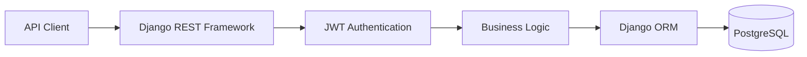
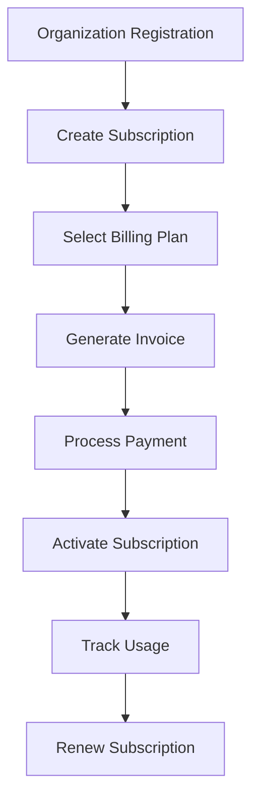
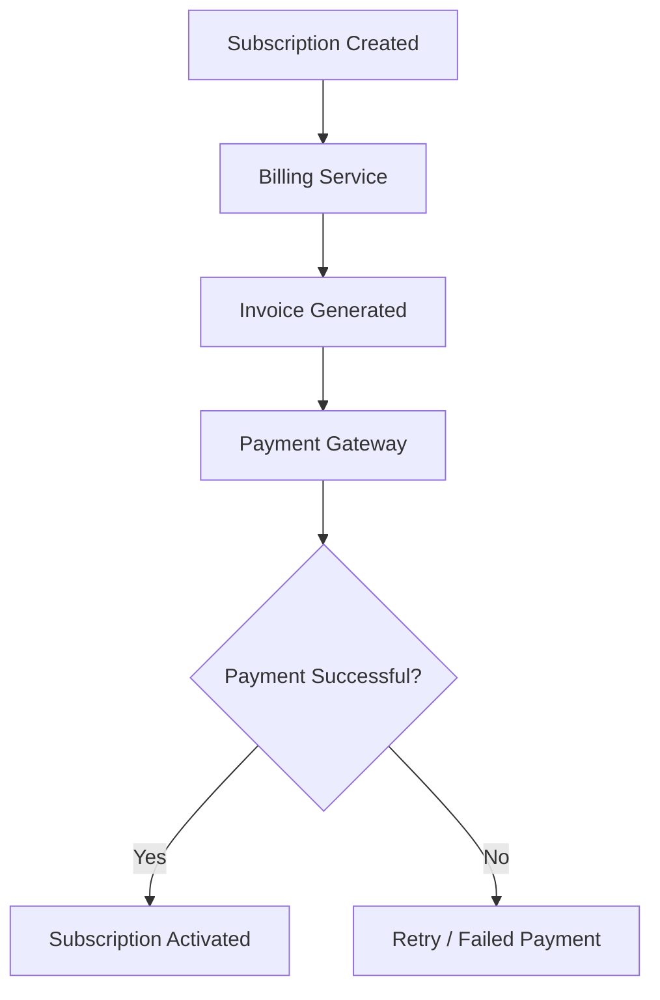
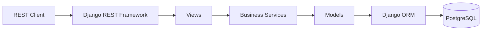

# 💳 SaaS Subscription Billing Platform


A production-inspired Django REST API for managing SaaS subscriptions, recurring billing, invoices, payments, and multi-tenant organizations.

The project follows a modular backend architecture where authentication, organizations, subscriptions, billing, invoicing, notifications, analytics, and audit logging are organized into independent Django applications, making the system scalable, maintainable, and production-ready.

---

# ✨ Core Features

- Multi-tenant Organization Management
- Subscription Plan Management
- Flexible Billing Cycles
- Invoice Generation
- Payment Tracking
- Usage Tracking & Analytics
- Team Management
- Role-Based Access Control (RBAC)
- JWT Authentication
- Audit Logging
- Notification System
- Django Admin Dashboard

---

# 🏗️ System Architecture



---

# 🔄 Subscription Workflow



---

# 💳 Billing Workflow



---

# 🏛️ Layered Backend Architecture



---

# 📂 Project Structure

```text
saas-subscription-billing/
│
├── apps/
│   ├── analytics/
│   ├── audit_logs/
│   ├── billing/
│   ├── core/
│   ├── invoices/
│   ├── notifications/
│   ├── organizations/
│   ├── subscriptions/
│   ├── teams/
│   ├── usage_tracking/
│   └── users/
│
├── config/
├── tests/
│
├── docker-compose.yml
├── Dockerfile
├── manage.py
├── requirements.txt
├── pytest.ini
├── README.md
└── .env
```

---

# 🛠️ Technology Stack

| Category | Technology |
|----------|------------|
| Language | Python 3.11 |
| Framework | Django |
| API | Django REST Framework |
| Database | PostgreSQL |
| ORM | Django ORM |
| Authentication | JWT |
| Containerization | Docker & Docker Compose |
| Background Tasks | Celery |
| Cache | Redis |
| Testing | Pytest |

---

# 🔐 Authentication & Authorization

- JWT Authentication
- Role-Based Access Control
- Multi-tenant Data Isolation
- Organization-Level Permissions
- Secure API Endpoints

---

# 🗄️ Core Domain Models

The system is built around the following business entities:

- Users
- Organizations
- Teams
- Subscription Plans
- Active Subscriptions
- Billing Records
- Invoices
- Payments
- Usage Metrics
- Notifications
- Audit Logs

The project follows normalized relational database principles using Django ORM.

---

# 🚀 Getting Started

## Clone the repository

```bash
git clone https://github.com/your-username/saas-subscription-billing.git

cd saas-subscription-billing
```

## Create a virtual environment

```bash
python -m venv .venv
```

## Activate the virtual environment

### Windows

```bash
.venv\Scripts\activate
```

### Linux/macOS

```bash
source .venv/bin/activate
```

## Install dependencies

```bash
pip install -r requirements.txt
```

## Configure environment variables

```bash
cp .env.example .env
```

Update the required configuration values.

## Apply migrations

```bash
python manage.py migrate
```

## Create an administrator

```bash
python manage.py createsuperuser
```

## Run the development server

```bash
python manage.py runserver
```

API Base URL

```
http://127.0.0.1:8000/api/
```

---

# 🚀 Future Improvements

- Stripe Integration
- Razorpay Integration
- Webhook Automation
- Background Invoice Processing
- Email Queue System
- Celery + Redis
- Advanced Analytics Dashboard
- Rate Limiting
- API Versioning
- OpenAPI / Swagger Documentation
- Kubernetes Deployment
- CI/CD Pipeline
- Monitoring & Centralized Logging
- Event-Driven Billing Workflows

---

# 💡 Engineering Highlights

This project demonstrates production-inspired backend engineering concepts including:

- Modular Django Application Design
- REST API Development
- JWT Authentication
- Multi-tenant Architecture
- Subscription Lifecycle Management
- Invoice & Billing Workflows
- Role-Based Authorization
- Transaction Management
- Background Task Processing
- Audit Logging
- Scalable Backend Design
- Containerized Development Environment

---

# 🎯 Why This Project?

This project goes beyond basic CRUD APIs by implementing backend workflows commonly found in modern SaaS platforms.

It models how subscription-based businesses manage:

- Organizations
- Teams
- User Permissions
- Subscription Plans
- Recurring Billing
- Invoice Generation
- Payment Tracking
- Usage Analytics
- Audit Logging
- Notification Workflows

The project is designed to demonstrate scalable backend engineering practices and production-oriented system design for backend developer roles.

---

# 📄 License

MIT License.
